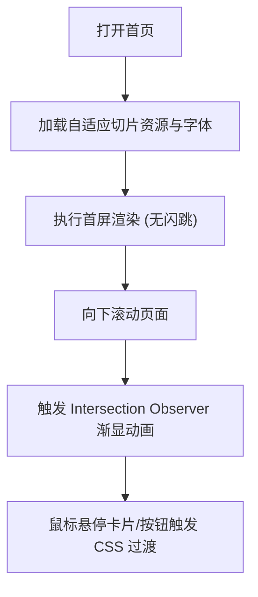

## 1. 产品概述
ULVAC 全球官网 PC/TOP 页面的 1:1 像素级静态重构。
- 基于 Figma 设计稿及提供的视觉截图（screenshot_18600_15105.png），实现高还原度的纯静态 HTML 页面。
- 重点关注排版、CSS 自定义属性（Design Tokens）提取、响应式适配（≥320px、≥768px、≥1024px、≥1440px）及页面滚动特效与交互的精细还原。

## 2. 核心功能

### 2.1 功能模块
1. **英雄区域 (Hero Section)**: 背景大图、标题展示及主行为呼唤按钮。
2. **业务板块 (Business Areas)**: 6 大业务领域图文卡片网格布局。
3. **公司概况 (Company Profile)**: 公司关键数据统计指标展示。
4. **新闻动态 (Featured News)**: 最新企业新闻卡片列表。
5. **全球基地 (Main Bases)**: 带有交互或动画特效的全球业务网络展示区域。
6. **价值报告 (Value Report)**: 底部全宽特色区块及页脚导航。

### 2.2 页面详情
| 页面名称 | 模块名称 | 功能描述 |
|-----------|-------------|---------------------|
| 首页 (index.html) | 全局导航 (Header) | 包含 Logo、主要导航链接、语言切换及滚动吸顶交互。 |
| 首页 (index.html) | 英雄区域 | 首屏视觉展示，视差或轻量动画。 |
| 首页 (index.html) | 业务板块卡片 | 响应式网格布局，悬停时产生阴影、颜色渐变及微动效 ( translateY(-2px) )。 |
| 首页 (index.html) | 公司概况 | 数字滚动统计或静态数字展示区。 |
| 首页 (index.html) | 动态效果 | 滚动触发的渐显/滑入动画 (基于 Intersection Observer + animation-range)。 |
| 首页 (index.html) | 页脚 (Footer) | 多级网站地图、联系信息及版权声明。 |

## 3. 核心流程
用户在不同设备上浏览静态展示页面，体验平滑的滚动动画与交互。

## 4. 用户界面设计
### 4.1 设计风格
- 严格遵循 ULVAC 提供的 Figma 视觉稿。
- 提取 Figma 变体、自动布局与间距规范为 CSS Variables，集中在 `:root` (`tokens.css`) 管理。
- 动效时长与缓动函数统一配置，确保交互节奏与 Figma Prototype 录屏一致（误差 ≤50ms）。
- 所有特效需提供 `prefers-reduced-motion` 媒体查询。

### 4.2 页面设计概览
| 页面名称 | 模块名称 | UI 元素 |
|-----------|-------------|-------------|
| 首页 | 字体与排版 | 非系统字体子集化为 WOFF2，`font-display: swap`，字号/行高/间距误差 ≤1px。 |
| 首页 | 媒体资源 | SVG/PNG/WebP 格式图片，按 @1x/@2x/@3x 自适应加载；Canvas/Lottie 轻量动画 (≤150KB)。 |
| 首页 | 布局结构 | HTML5 语义化标签，基于 CSS Grid + Flexbox 构建 1:1 对齐的响应式布局。 |

### 4.3 响应式设计
- 提供断点：`≥320px` (移动端), `≥768px` (平板), `≥1024px` (小屏桌面), `≥1440px` (大屏桌面)。
- 桌面端优先或移动端优先皆可，最终需完美还原各断点布局。

### 4.4 性能与验收标准
- 0 错误 W3C HTML/CSS 校验。
- Lighthouse 跑分 ≥95 (性能、可访问性、最佳实践、SEO)。
- 首屏 LCP ≤ 2.5s，总资源大小 ≤ 1MB。
- 不依赖任何未经请求的外部库。
