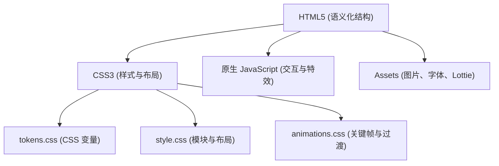

## 1. 架构设计


## 2. 技术说明
- **前端核心**: 纯静态 HTML5, CSS3, ES6+ JavaScript。
- **不依赖前端框架**: 本次项目不使用 React/Vue 等框架，仅采用原生技术栈以满足极致性能和静态页面交付需求。
- **布局方案**: CSS Grid 与 Flexbox，结合媒体查询实现精准还原。
- **样式管理**: 原生 CSS Variables (`:root`) 实现 Design Tokens，无需预处理器。
- **动画方案**: 
  - 滚动监听：`IntersectionObserver` API。
  - 微动效：CSS `transition` 和 `transform`。
  - 复杂动画：可选 Canvas API 或 Lottie-Web (仅限必要区域，总大小严格控制)。
- **构建与测试工具**: 无复杂构建流，推荐使用 `serve` 等轻量本地服务器进行预览。

## 3. 路由定义
| 路由 | 目的 |
|-------|---------|
| `/index.html` | 默认首页，包含所有内容。 |

## 4. API 定义
无后端接口。
页面中若存在动态数据结构（如新闻列表），使用本地 JSON 文件作为数据源或直接在 HTML 中静态占位。
示例 (可选):
```json
// js/data/news.json
[
  {
    "date": "2023.12.20",
    "title": "ULVAC receives the '2023 TSMC Excellent Performance Award.'",
    "tag": "Corporate"
  }
]
```

## 5. 文件与目录结构
```text
/
├── index.html           # 入口文件
├── css/
│   ├── reset.css        # 样式重置
│   ├── tokens.css       # 颜色、间距、字体等设计令牌
│   ├── style.css        # 核心布局与模块样式
│   └── animations.css   # 动画及媒体查询 (prefers-reduced-motion)
├── js/
│   ├── main.js          # IntersectionObserver 等全局逻辑
│   └── data/            # (可选) 本地 JSON 数据占位
├── assets/
│   ├── images/          # PNG, WebP (支持 @1x, @2x, @3x)
│   ├── icons/           # SVG 图标
│   └── fonts/           # 子集化 WOFF2 字体文件
└── README.md            # 项目说明文档
```

## 6. 兼容性与质量保证
- **浏览器兼容**: 最新 2 版 Chrome、Safari、Firefox、Edge（无需支持 IE11）。
- **性能优化**:
  - `font-display: swap` 处理字体闪跳。
  - `` 标签使用 `srcset` 结合 `sizes` 属性，或 `<picture>` 标签进行响应式图片加载。
  - 脚本添加 `defer` 属性。
- **规范标准**: W3C 标准校验 0 错误；Lighthouse 全指标 ≥95。
