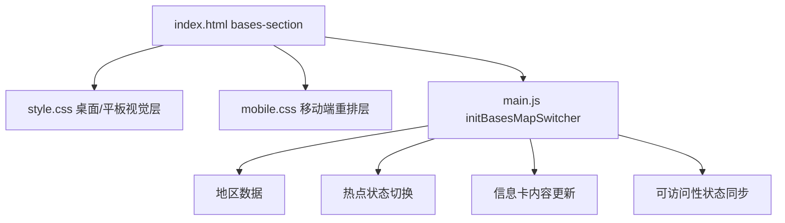

# 地区地图切换模块 DESIGN

## 方案概览

本模块以现有静态站点为基础，使用 `HTML + CSS + Vanilla JS` 替换原有 `bases-section` 占位实现，构建一个可交互的地区地图切换模块。

核心原则：

1. 保留 Figma `18511_42454` 的基础视觉骨架：
   - 蓝色渐变背景
   - 标题
   - 白色按钮
   - 世界地图底图
2. 在地图上叠加可交互定位点，而不是把交互写死在图片里。
3. 数据与视图解耦，所有地区信息通过 JS 数据源驱动。
4. 桌面端以地图为主视觉，平板端保留地图交互，手机端改成“地图 + 信息卡纵向堆叠”。

## 模块替换范围

### 受影响文件

- [index.html](file:///c:/Users/gavin.guo/Desktop/ULVAC%20project/index.html)
- [style.css](file:///c:/Users/gavin.guo/Desktop/ULVAC%20project/css/style.css)
- [mobile.css](file:///c:/Users/gavin.guo/Desktop/ULVAC%20project/css/mobile.css)
- [main.js](file:///c:/Users/gavin.guo/Desktop/ULVAC%20project/js/main.js)

### 资源

- 优先使用本地地图资源：
  - [world_map_bg.png](file:///c:/Users/gavin.guo/Desktop/ULVAC%20project/assets/images/world_map_bg.png)
  - 或 Figma 导出的 [mp4y06ci-ufa9rxw.png](file:///c:/Users/gavin.guo/Desktop/ULVAC%20project/.figma/image/mp4y06ci-ufa9rxw.png)

## 结构设计

### DOM 草图

```html
<section class="bases-section">
  <div class="bases-map-shell container">
    <div class="bases-map-header">
      <h2>ULVAC Main Bases</h2>
      <a class="btn-map-bases" href="#">See All Group Companies</a>
    </div>

    <div class="bases-map-stage">
      

      <div class="bases-map-hotspots" role="tablist" aria-label="ULVAC Main Bases Regions">
        <button class="bases-hotspot is-active" data-region="japan" ...></button>
        <button class="bases-hotspot" data-region="asia" ...></button>
        <button class="bases-hotspot" data-region="europe" ...></button>
        <button class="bases-hotspot" data-region="north-america" ...></button>
      </div>

      <article class="bases-region-card" aria-live="polite">
        <div class="bases-region-card-media">
          
        </div>
        <div class="bases-region-card-body">
          <h3>Japan</h3>
          <ul>
            <li>Sales & Service: 35</li>
            <li>R&D: 4</li>
            <li>Manufacturing: 11</li>
          </ul>
        </div>
      </article>
    </div>
  </div>
</section>
```

### 模块分层



## 数据模型

### 建议数据结构

```js
const BASES_REGIONS = [
  {
    id: 'japan',
    name: 'Japan',
    image: 'assets/images/bases-japan.jpg',
    alt: 'Tokyo tower skyline',
    stats: [
      { label: 'Sales & Service', value: '35' },
      { label: 'R&D', value: '4' },
      { label: 'Manufacturing', value: '11' }
    ],
    position: {
      desktop: { left: '50.8%', top: '43.6%' },
      tablet: { left: '50.2%', top: '43.8%' },
      mobile: { left: '52%', top: '45%' }
    }
  }
];
```

### 默认地区

- 默认激活 `japan`
- 页面加载时：
  - 第一颗点为选中态
  - 信息卡渲染 `Japan`
  - `aria-pressed="true"`

## 交互设计

### 1. 定位点循环闪烁

每个定位点由三层构成：

1. 实心核心点
2. 外层光晕环
3. 选中态扩散波纹

动画规则：

- 频率：`1.5 次/秒`，即单轮约 `666ms`
- 非选中态：
  - 轻微透明度变化
  - 轻微 `scale` 呼吸
- 选中态：
  - 核心点常亮
  - 外层环持续扩散
  - 强化边框/阴影

建议动画：

```css
@keyframes hotspot-pulse {
  0%   { transform: scale(0.88); opacity: 0.35; }
  45%  { transform: scale(1.15); opacity: 0.85; }
  100% { transform: scale(1.45); opacity: 0; }
}
```

降级策略：

- `prefers-reduced-motion: reduce` 下关闭循环 pulse，只保留静态选中态。

### 2. 地区切换逻辑

点击任意定位点时：

1. 移除上一个点位的 `is-active`
2. 给当前点位添加 `is-active`
3. 更新卡片标题、图片和统计项
4. 对卡片做淡入/位移动画
5. 更新 `aria-pressed` 与 `aria-current`

过渡策略：

- 卡片切换采用：
  - `opacity`
  - `transform: translateY(...)`
  - `filter: blur(...)` 可选轻量使用
- 避免直接替换导致闪烁

### 3. 标准交互体验

每个定位点应具备：

- `hover`：轻微放大 + 光晕增强
- `focus-visible`：明显外轮廓
- `active`：缩放回弹
- `selected`：双层环形标识

键盘逻辑：

- `Tab` 可聚焦到点位
- `Enter / Space` 可切换地区
- 左右或上下方向键可选做顺序切换

## 样式方案

### 桌面端

- 容器遵循当前页面 container 体系
- 模块背景采用 Figma 的线性渐变
- 地图图片铺满主舞台
- 地区卡片绝对定位于地图中央偏下区域
- 点位使用绝对定位百分比，不写死像素

### 平板端

- 保留地图交互
- 缩小卡片尺寸
- 点位点击热区放大
- 标题、按钮与地图上下间距缩小

### 手机端

- 模块仍保留地图主视觉，但简化成单列布局
- 卡片改为地图下方或地图内底部固定区域
- 点位保持可点击，但避免过小
- 统计信息改为紧凑列表

## JS 行为设计

### 新增函数

在 [main.js](file:///c:/Users/gavin.guo/Desktop/ULVAC%20project/js/main.js) 中新增：

```js
initBasesMapSwitcher()
```

### 主要职责

1. 读取模块根节点
2. 初始化默认地区
3. 给所有热点按钮绑定点击事件
4. 管理当前选中态
5. 更新卡片 DOM 内容
6. 同步无障碍属性
7. 在窗口 resize 时处理必要的位置或状态修正

### 更新策略

- 卡片内容直接替换文本与图片 `src`
- 不重新创建整个模块 DOM
- 使用状态类驱动过渡动画

## 可访问性设计

- 热点使用原生 `<button>`
- 每个热点具备：
  - `aria-label="Switch to Japan region"`
  - `aria-pressed="true/false"`
  - `aria-controls="bases-region-card"`
- 卡片容器具备：
  - `id="bases-region-card"`
  - `aria-live="polite"`

## 响应式规则

### 断点

- `> 1024px`：桌面
- `769px - 1024px`：平板
- `<= 768px`：手机

### 适配重点

1. 地图舞台高度
2. 热点按钮热区尺寸
3. 卡片宽度与定位方式
4. 标题和按钮的垂直节奏

## 验证方案

### 本地自动化验证

1. 桌面视口截图
2. 平板视口截图
3. 手机视口截图
4. 交互态截图：
   - 默认态
   - 切换后态

### 手动验证项

1. 点击热点是否切换卡片
2. 选中态是否唯一
3. 键盘聚焦是否可见
4. `prefers-reduced-motion` 是否降级
5. 手机端是否仍可点按和阅读

## 实施步骤

1. 重写 `bases-section` HTML 结构
2. 新增桌面/平板地图样式
3. 重写移动端 `bases-section` 样式
4. 新增地区数据与 `initBasesMapSwitcher()`
5. 生成多视口截图并校验交互
