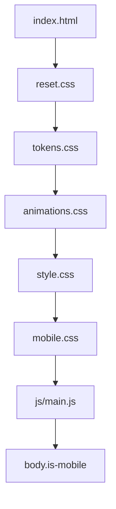

# 移动端样式链路审查

## 样式加载顺序

| 顺序 | 文件 | 类型 | 引入方式 | 说明 |
| --- | --- | --- | --- | --- |
| 1 | `css/reset.css` | 全局基础 | `<link>` | 清理默认样式 |
| 2 | `css/tokens.css` | 设计变量 | `<link>` | 全局 token |
| 3 | `css/animations.css` | 公共动效 | `<link>` | 滚动和 hover 动画 |
| 4 | `css/style.css` | PC 主样式 | `<link>` | 桌面优先基础样式 |
| 5 | `css/mobile.css` | 移动端覆盖 | `<link>` | 放在 PC 样式之后、JS 之前 |
| 6 | `js/main.js` | 运行时 | `<script>` | 根据视口给 `body` 注入 `is-mobile` |

## 根因结论

- `mobile.css` 已正确加载，问题不在 `<link>` 顺序。
- 真实根因有两类：
- `mobile.css` 顶部曾混入错误片段，导致媒体查询块解析中断，部分移动端规则完全失效。
- `style.css` 中桌面规则如 `.news-card.large h3`、`.news-card.small h3` 比原先的 `.news-content h3` 更具体，造成移动端字号被覆盖。

## 覆盖策略

- 统一采用 `PC 优先 + body.is-mobile 覆盖`。
- 所有移动端规则都包裹到 `@media (max-width: 768px)` + `body.is-mobile` 下。
- 仅保留必要的 `!important`：
- `body.is-mobile .container { width: calc(100% - 32px) !important; }`
  理由：桌面容器宽度是全局布局基础，需要在移动端强制改写。
- `body.is-mobile .main-nav, body.is-mobile .lang-selector { display: none !important; }`
  理由：桌面导航在 header 中结构固定，移动端必须稳定隐藏。
- `body.is-mobile .business-container { display: none !important; }`
  理由：移动端使用独立 accordion 结构，避免桌面业务区同时出现。
- `body.is-mobile .bases-bg, body.is-mobile .base-card { display: none !important; }`
  理由：移动端该模块改为占位结构，必须强制屏蔽桌面内容。

## 选择器权重对比

| 场景 | 旧规则 | 新规则 | 结果 |
| --- | --- | --- | --- |
| News 标题字号 | `.news-content h3` | `body.is-mobile .news-card.large .news-content h3` / `body.is-mobile .news-card.small .news-content h3` | 移动端 16/24 成功覆盖桌面 18/27 |
| Hero 标题字号 | `.hero-content h1` | `body.is-mobile .hero-content h1` | 移动端 34/44 稳定生效 |
| Footer 链接显示 | `.footer-nav-group a` | `body.is-mobile .footer-nav-group a` | 移动端 `display:block` 生效 |
| Header 菜单按钮 | `.menu-toggle` | `body.is-mobile .menu-toggle` | 移动端菜单在手机视口显示 |

## 自动化验证

- 样式断言报告：[MOBILE_STYLE_TEST_REPORT.md](file:///c:/Users/gavin.guo/Desktop/ULVAC%20project/docs/mobile-top/MOBILE_STYLE_TEST_REPORT.md)
- 截图回归产物：
- [mobile_375x812_home.png](file:///c:/Users/gavin.guo/Desktop/ULVAC%20project/mobile_375x812_home.png)
- [mobile_375x812_menu.png](file:///c:/Users/gavin.guo/Desktop/ULVAC%20project/mobile_375x812_menu.png)
- [mobile_375x812_accordion.png](file:///c:/Users/gavin.guo/Desktop/ULVAC%20project/mobile_375x812_accordion.png)

## 维护规范

- 移动端样式优先策略：继续使用 `PC 基础 + body.is-mobile 覆盖`，禁止再回到裸 `@media` 与局部 `!important` 混写。
- 新增移动端规则时，优先复制桌面选择器语义路径，再在前面加 `body.is-mobile`，不要只写通用类名。
- 如出现“文件里有值但浏览器不生效”，先检查：
- `body` 是否带有 `is-mobile`
- `mobile.css` 是否存在语法中断
- 桌面端是否有更高 specificity 的规则
